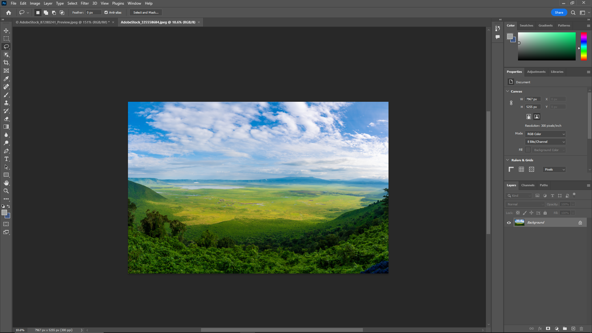

# A beginner's Experience with Photoshop

I decided to get on photoshop and see if I could edit a photo. My main goal with photoshop at the moment is just to learn how to edit a photo, which means that I want to see how learnable or how easy it is to learn photoshop. I decided to start with a stock photo of a field. 

