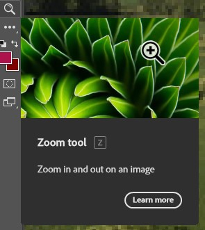

# A beginner's Experience with Photoshop

I decided to get on photoshop and see if I could edit a photo. My main goal with photoshop at the moment is just to learn how to edit a photo, which means that I want to see how **learnable** or how easy it is to learn photoshop. I decided to start with a stock photo of a field. 

First I decided I wanted to zoom in on my picture to better look at it. Based on **industry conventions**, which are methods usually done in the industry. I would expect to be able to zoom in and out using the Ctrl(control) and mouse wheel shortcuts. Usually, to zoom in, you use to control and move the mouse wheel forward and zoom out backward. This is what happened when I tried to zoom in.

When trying to zoom in with the control mouse wheel, I moved my picture to the left using the scroll bar down at the bottom of the app. It was completely unexpected. The control mouse wheel backward moved my screen left, which was expected at that point. At this point, I had no idea how to zoom my picture in. I decided to look at the command bar at the top, specifically edit, and image. I thought, well making my image larger has to be here then. I was not disappointed as the Image menu had an option called Image size, with a shortcut of CTRL ALT I. 

I wasn’t sure at this point how big I wanted to make the image, so I experimented with the size options. I picked Fit To 1024, 768 px, 72 ppl, I wanted to see if I could make the image fit my screen. Unfortunately, that made my picture too small, to the point where I was barely able to see the photo. 

At this point, I realized I had no idea what I was doing and felt like I was ruining the picture. Thankfully photoshop seems to have a good error-prevention system with its undo button which allowed me to reset the image all the way back to where I started. At this point, I was clueless about how I could zoom in while keeping the image quality intact. I thought, the “ctrl mouse wheel” was used to move right and left, what did the “Alt mouse wheel shortcut” do? I attempted to use the shortcut and found out it was the correct way to zoom in on the picture. I’m able to zoom all the way to see pixel boxes. The zoom is centered on my mouse pointer.

Now that I have some basic movement handled, I want to see what I can do with the picture. I looked at the side of the screen and noticed all these symbols and thought that those were probably the tools to do most of the things in photoshop. 

Each symbol is a different tool to use in photoshop. Each symbol when hovered over will show the user a small couple seconds tutorial that shows what each tool does. This makes the photoshop much more learnable to beginners. For example, the eraser tool shows the circle erasing the color when hovering over it. One thing I realized was that you can't actually click and drag your mouse to move around your picture unless you use a specific tool on the left to do so.

Surprisingly there is a zoom tool here.

I decided I didn’t want any clouds in my image so I could have a clear sky. I started looking for a way to remove the clouds. I noticed a tool that would highlight an area called Lasso. 

I also noticed a tool that would take a sample of a colour and make it my selected color, however it doesn’t seem to affect the background color. 

I decided to make a selected area as big as the sky so i can select all the clouds. My selected area is highlighted by black and white lines constanty moving. I noticed I cannot do anything else outside of this marked area. So if i decided to erase something outside of the selected area, I would need to remove my selected area by using the same lasso tool and just click the screen to get rid of my area. This is especially good for use as I can erase without having to worry about accidentily erasing outside the line. 

Unfortunately, the eraser tool erases things and leaves behind a color you have selected for what i assume is the background color. This means to get the right color to leave behind, I have to manually use the eyedrop tool to select a color i want, open the color menu, then copy the color code, then paste the color code to the background color code. 

[InitialPhoto](BackgroundColor.jpg)

After copy and saving the color code to the background color, which is the lower color box, it looks like this. 

[InitialPhoto](ColorTwoBoxes.jpg)

After deciding the color I want, I started erasing everything in the marked area except for a small bit of the top blue color. I saw a tool called the gradient tool that should make one color slowly turn to another over a certain distance in the photo. So, I need to save some of the top sky color. 

[InitialPhoto](MarkAreaFirstErase.jpg)

Next, I grabbed the top sky blue color and made sure my color selected was it. I used the gradient tool and quickly realized that I made a mistake in my color as the top color needed to be in the background color slot. 

[InitialPhoto](GradientMessUp.jpg)

After fixing the color it looked alot better. 

[InitialPhoto](MarkAreaAlmostFinished.jpg)

It is starting to actually look like the sky when looking at it from far away. The gradient tool is great for when you need to make a steady transformation from one color to the next. It is very **efficient** and **effective**, however the color selection makes it a bit tedious for me, which is a weakness. **Efficient** is how quick a task is and **Effective** is how successful it is in fulfilling a task. Next I want to clean up all the spots I missed near the sky line to make it more cohesive. 

[InitialPhoto](Finished.png)

Overall I think I did an ok job making this picture have no clouds while also learning some basics in Photoshop. It was alot more satisfying than I expected it to. Satisfying is how good and fufilled an action gave you. Overall photoshop was efficient, and satisfying to learn. As I am not a photographer or artist, photoshop is not necessarily useful to me. Useful is how it is able to be used by the user. 

The strengths of photoshop is that it is a very effective and efficient program to edit photos. It has wonderful error prevention system in place as you can undo any mistakes using the undo tool. It is easy to learn the very basic tools in place as they show you a mini video of what the tool does when you hover the mouse over it. 

My main problems with photoshop is that the shortcuts to zoom in are changed to Alt-mousewheel instead of Ctrl-mousewheel. The color selection is a pain to understand.  It gave me problems trying to figure out the color system from a beginners perspective. Without understanding the color selection system the experience becomes alot more frustrating as whatever you try to do might have a different color than expected. I think one of the problems that my mental model of how it works is not matching with the actual way it works. A mental model is how any user would expect something to work. I think it would help if the zoom in shortcut was made to mimic the mental model of most people as the industry conventions suggest having the zoom shortcut at Ctrl-mouswheel instead of Alt-mousewheel. This would lower the amount of people who will have different mental models from how it is supossed to work. The eyedroper tool is very helpful but a bit confusing to use. A suggestion for the colors would be to have the eyedropper tool work on both the front color and the back color. 

