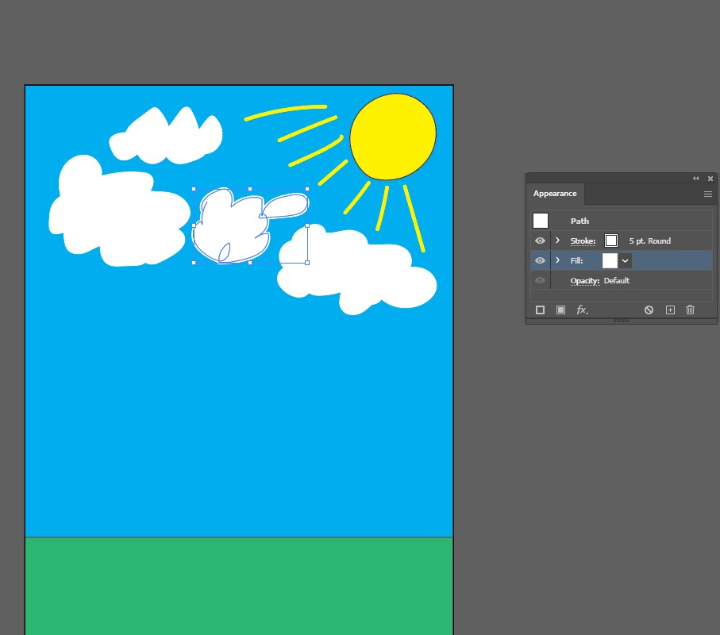

# A Beginner's Experience With Adobe Illustrator

By Max Hibbard

Journal Entry: 12/11/2022

I decided to get on Adobe Illustrator and see if I can make some art. My main goal with Adobe Illustrator at the moment is to learn how to use the software in order to create some art. I want to see how **Learnable** or how easy it is to use adobe illustrator is. When I start with Adobe Illustrator, I start with nothing. 

Immediately I notice how similar this layout is to Adobe Photoshop. The layout is very **memorable**. **Memorable** means it is likely to be remembered and I really like the dark theme and minimalist design. So I’m thinking that my experience with photoshop will help me learn how to use Adobe  Illustrator. Next, I look at the left side of the screen to see if the symbols on the left are like how they are in photoshop. 

And my expectation that the symbols on the left represents tools are proven correct when I look at a random symbol. Looking at the rest I noticed some familiar tools from photoshop. 

There are a few others that seem to be a staple to the adobe programs. These are like text and the selection tool. 

Now that I see some basics of Illustrator, I tried to get started on making some art. I started using the rectangle tool to make something like an artboard to draw on. 

That did nothing. Next, I looked through the tools on the left to see if there was something to help. I found a tool that says it will let me create and manage artboards. So my expectation was that I would use it to make an artboard. 

I clicked it and tried using it and nothing happened. It wouldn’t work. At this point, I was unsure how to precede correctly in using the site so I thought when in doubt, go look at the top menu of the program. 

I went here and clicked file to see what options showed up.

From this list of options, I clicked “New” and this showed up.  

I thought I was looking at a way to create a new artboard. Wasn’t sure what all the options were on the right besides editing the artboard's dimensions so I ignored it and just clicked create. This showed up. 

So I finally created an artboard to put anything I like on. I was curious about what would happen when I clicked on the x in untitled 1 with the expectation it would just delete my artboard. In reality, Illustrator is completely closed. So that was completely unexpected.

Trying to open Illustrator again with the open option brings up a file explorer menu to search for something to open. Clicking New file brings me back to a way to create a new artboard.

I have no idea how I opened Illustrator without an artboard. There doesn’t seem to be a way to do it. So I decided to create another artboard to begin making some art. I quickly tested if I could put stuff on the artboard using the rectangle tool and it works. 

I decided to make the artboard a different color and started to look for a way to change the color. Randomly looking around I managed to find Artboard settings and noticed there was no way to change the color of my artboard. 

Clicking cancel as there was nothing there I really wanted, I decided to change the color of my artboard manually using the rectangle tool to encompass the whole artboard and use that. Before that, I decided to make sure the zoom-in feature was the same as in adobe photoshop. I wasn’t really surprised that it was the same. Using “Alt + scroll wheel” change your zoom levels. It's starting to feel like it is a convention when using Adobe products. Continuing on to changing the color of my artboard, I deleted the other test rectangles and made a rectangle covering the artboard in the color blue. 

Now let's make a green field with a sun. I decided to use a green rectangle for the ground on the button. 

Using the curvature tool, I try to make a circle of the sun in the top right corner. Using the tool was not the most intuitive way to make a circle but I think it turned out nicely. 

I then decided to make some lines coming from the sun to simulate light coming from the sun. Using the brush tool to make the lines turn out like this. 

I tried to change the brush lines to the same color as the sun only to seemingly find out you cant. The paintbrush lines have a lined that crosses out the fill tool in the properties menu of the lines. 

Looking further, I clicked the three dots in the appearance area on the property menus and it opened up an appearance panel. 

From this panel, it seems like I can change the color of the lines to yellow. The little square box next to the stroke option seems to be the color option. Clicking it opens up the menus below. 

I clicked yellow and it changed the lines to yellow. I proceed to do this for all my lines coming from the sun. 

Now that my sun is done, I want to add some clouds to the sky and maybe a stick man on the ground. Using the paintbrush tool again, I draw some clouds in the sky. After drawing the clouds in the sky, I use the appearance panel to change the color of the lines to white and also use the fill tool in the appearance panel to make the clouds white. I had to do this since I can’t seem to find a fill tool on the left-hand side of the screen where the tools are. There is no efficient way to fill my objects besides going to the appearance panel. 

There is one thing left to do and that is to make a stick figure down on the ground. I decided to give him a hat and a sword at the end because I thought, why not. I colored the sword white with the handle and guard black. This is what the final picture became. 

A stick figure in a field of grass with some clouds in the sky and the sun bearing down on him. He also has a hat and sword. 

Overall I think I did an ok job working with Adobe Illustrator to make some art. It was very **satisfying** as I lost track of time a bit while working on this art. **Satisfying** is how good and fulfilled an action gave you. It was honestly a lot more **satisfying** using this to create art than using something like ms paint. It was also very **memorable** as I really enjoyed the dark theme and my experience with photoshop transferring over to help me learn and use illustrator. 

The strength of Adobe Illustrator is that it is a very **effective** and **efficient** way to create art on artboards. **Efficient**** is how quick a task is and **effective** is how successful it is in fulfilling a task. There were many tools that were useful in learning how to use illustrator. Just like in adobe Photoshop, the illustrator has a mini video of what each tool does when you hover the mouse over it.

Just like in Adobe Photoshop, Illustrator had the same problem of having the zoom feature connected to “The alt-mouse wheel” instead of the “Ctrl-mouse wheel”. Again, the **industry conventions**, which are methods usually done in the industry, are not met as zoom is mainly a “Ctrl-mouse wheel”. The color system also confused me a little when I tried to change the color of the paintbrush lines from the sun. The icon had the fill tool look like it was crossed out and not usable. I sort of expected the fill tool to change the color of my lines, instead, it is the stroke box that controls the color of the line. Completely defied my expectations of how this would work while I was using illustrator. It didn’t really map to my **mental model** of how it would work. A **mental model** is how any user would expect something to work. Suggestions to fix these problems would be changing things to better fit **mental models** and **industry conventions**. Make the tool to change the color of the line more visible and identifiable. I would also recommend a way to change the color of the artboard as having to make a rectangle the size of the artboard is an unneeded extra step in my opinion. Just have the option to change the artboard color. Not everyone wants a blank white artboard. 

